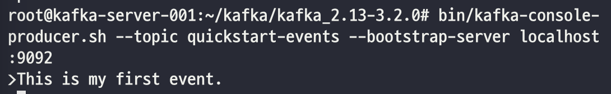
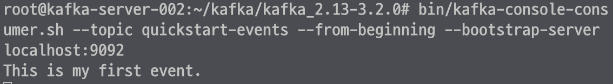

## env
~~~
OS: Ubuntu 20.04

server1: 192.168.100.9 
server2: 192.168.100.10
server3: 192.168.100.11
~~~

## kafka 설치하기
#### install Java
~~~
$ sudo apt-get update && sudo apt-get upgrade
$ sudo apt-get install openjdk-11-jdk
$ java -version # 설치확인
$ vim ~/.bashrc
  export JAVA_HOME=$(dirname $(dirname $(readlink -f $(which java))))
  export PATH=$PATH:$JAVA_HOME/bin
$ source ~/.bashrc
$ echo $JAVA_HOME # 환경변수 세팅 확인
~~~

#### Download kafka
~~~
$ wget https://dlcdn.apache.org/kafka/3.2.0/kafka_2.13-3.2.0.tgz
$ tar -xzf kafka_2.13-3.2.0.tgz
~~~

#### ZooKeeper config
dataDir: ZooKeeper 관련 데이터들이 저장되는 디렉토리이다.
ticktime: 아래 설정할 initLimit, syncLimit 의 체크주기이다. ms 단위이다.
initLimit: follower가 leader와 연결 시 허용되는 시간이다. ticktime과 곱한 값이 된다.
syncLimit: follower가 leader와 sync되지 않는 상태를 허용하는 시간이다. ticktime과 곱한 값이 된다.
server.X: server.X=`<hostname>:<peerPort>:<leaderPort>` 포멧이다.
          leaderPort는 leader 선출에 사용되는 포트이다.
          X는 반드시 숫자여야 한다. X는 dataDir에 myid에 설정된 숫자와 같아야 한다.
          
~~~

$ vi bin/zookeeper.properties
  # custom setting
  dataDir=/var/lib/zookeeper
  clientPort=2181
  ticktime=2000
  initLimit=20
  syncLimit=5
  server.1=192.168.100.9:2888:3888
  server.2=192.168.100.10:2888:3888
  server.3=192.168.100.11:2888:3888
  
$ mkdir /var/lib/zookeeper
$ touch /var/lib/zookeeper/myid
$ echo 1 >> /var/lib/zookeeper/myid # 서버별로 1, 2, 3을 부여한다.
~~~

#### ZooKeeper Start
~~~
$ bin/zookeeper-server-start.sh -daemon config/zookeeper.properties
~~~
 
이왕 ZooKeeper를 시작헀으니, [tutorial](A_2_ZooKeeper-Tutorial.md)을 해보는 것도 좋을 것 같다.

#### Broker Config
브로커 설정의 필수 갑 세 가지는 `broker.id`, `log.dirs`, `zookeeper.connect`이다.

broker.id: 브로커의 고유 키 값이다. 숫자로 세팅가능하다. 서버 호스트명과 관련성있게 부여하면 관리가 용의하다.
log.dirs: kafka의 모든 데이터가 저장되는 경로이다. 
zookeeper.connect: ZooKeeper 연동을 위한 값이다. `<hostname>:<port>/<path>` 의 형식이다.
                   path를 명시하면 다른 어플리케이션도 해당 ZooKeeper 서버를 같이 사용하는데에 용이하다.  
advertised.listeners: 클라이언트가 브로커와 통신하기 위한 값이다. 

~~~
$ vi config/server.properies
  broker.id=1 # 서버별로 1, 2, 3을 부여한다.
  log.dirs=/root/kafka/kafka-logs
  zookeeper.connect==192.168.100.9:2181,192.168.100.10:2181,192.168.100.11:2181
  advertised.listeners=PLAINTEXT://192.168.100.9:9092 # 각 서버의 ip를 입력한다.
~~~

#### Broker Start
~~~
$ bin/kafka-server-start.sh -daemon config/server.properties
~~~

## QuickStart
#### topic 생성 
~~~
$ bin/kafka-topics.sh --create --topic quickstart-events --bootstrap-server localhost:9092
  Created topic quickstart-events.
~~~

#### publish
~~~
$ bin/kafka-console-producer.sh --topic quickstart-events --bootstrap-server localhost:9092
~~~

#### consume
~~~
$ bin/kafka-console-consumer.sh --topic quickstart-events --from-beginning --bootstrap-server localhost:9092
~~~

## Reference
- https://kafka.apache.org/quickstart
- https://zookeeper.apache.org/doc/current/zookeeperStarted.html
- https://kafka.apache.org/documentation/#brokerconfigs