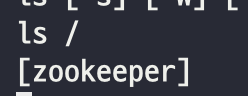
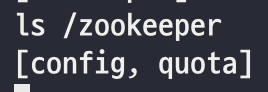
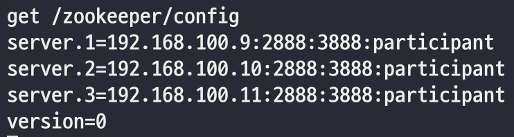
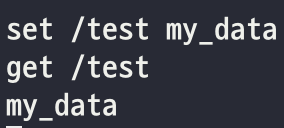
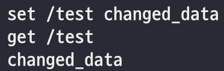
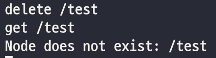

## ZooKeeper Shell 접속
kafka를 다운받으면, 기본적으로 ZooKeeper 설치파일도 다운된다.  
ZooKeeper 프로세스를 실행하고, kafka와 함께 설치된 ZooKeeper shell 실행파일로 ZooKeeper tutorial을 해보자.  

ZooKeeper는 여러개의 서버가 공통의 디렉토리를 사용하는 것으로 이해해도 된다.  

#### Shell 실행
~~~
$ bin/zookeeper-shell.sh 192.168.100.9:2181
~~~ 

#### 기본 명령어 실행
기본 명령어를 실행해보자.

~~~
$ ls /
~~~

~~~
$ ls /zookeeper
~~~

~~~
$ get /zookeeper/config
~~~

#### 데이터 생성
~~~
$ set /test my_data
$ get /test # 2번 서버에서 실행해서 확인해본다.
~~~

#### 데이터 변경
~~~
$ set /test changed_data
$ get /test # 2번 서버에서 실행해서 확인해본다.
~~~

### 데이터 삭제
~~~
$ delete /test
$ get /test # 2번 서버에서 실행해서 확인해본다.
~~~

## Reference
- https://zookeeper.apache.org/doc/current/zookeeperOver.html
- https://zookeeper.apache.org/doc/current/zookeeperStarted.html