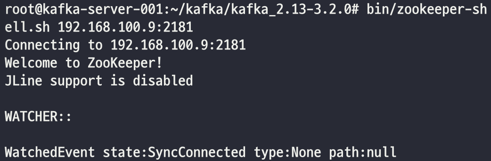

## ZooKeeper Shell 접속
kafka를 다운받으면, 기본적으로 ZooKeeper 설치파일도 다운된다.  
ZooKeeper 프로세스를 실행하고, kafka와 함께 설치된 ZooKeeper shell 실행파일로 ZooKeeper tutorial을 해보자.

#### Shell 실행
~~~
$ bin/zookeeper-shell.sh 192.168.100.9:2181
~~~ 

 

## Reference
- https://zookeeper.apache.org/doc/current/zookeeperStarted.html