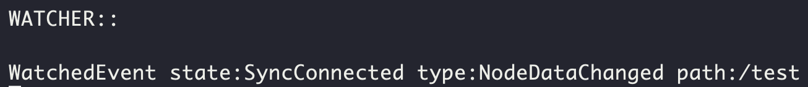

## ZooKeeper Watch (136p 참조)
Kafka 클러스터의 브로커들 중 하나는 controller 역할을 한다.  
반드시 하나의 `controller`가 있어야 하기 때문에 여기에 ZooKeeper를 이용한다.  
그리고 `contoller`가 비정상상태가 되거나 정상종료 혹은 다른 이유로 다른 `controller`가 선출되어야 하는 경우,  
ZooKeeper Watch를 이용하여 이벤트 발생을 감지하고 새로운 `controller`가 등록된다.

## Practice
두 개의 ZooKeeper 서버에서 ZooKeeper 콘솔에 접근한다.
~~~
# server 1
$ bin/zookeeper-shell.sh 192.168.100.9:2181  
# server 2
$ bin/zookeeper-shell.sh 192.168.100.10:2181 
~~~

`server 1`에서 테스트용 데이터를 등록하고, `server 2`에서 해당 데이터를 `watch` 한다.
~~~
# server 1
$ create /test my_data
# server 2
$ get -w /test
~~~

`server 1`에서 테스트용 데이터를 변경하고, `server 2`에서 해당 데이터 변경을 감지한다.
~~~
# server 1
$ set /test changed_data
~~~

`server 2`에서는 아래와 같은 로그가 찍힌다.

