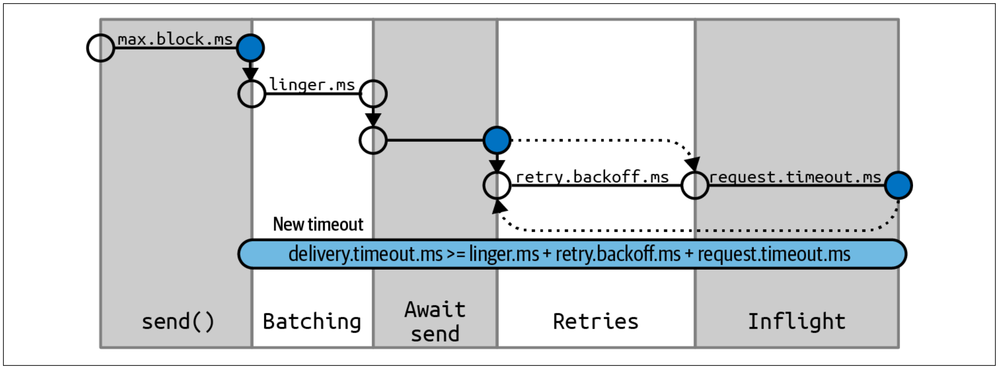

## Async Producer
사실상 Kafka는 Async Producer를 사용하는게 맞다. (52p 참조)  
아래 예시는 Async Producer의 기본 예시이다. 

~~~java
public class MyProducer {
    public void send() {
        Properties properties = new Properties();
        // required setting
        properties.put("bootstrap.servers", "kafka-lb-11608160-eb90449ba349.kr.lb.naverncp.com:9092");
        properties.put("key.serializer", "org.apache.kafka.common.serialization.StringSerializer");
        properties.put("value.serializer", "org.apache.kafka.common.serialization.StringSerializer");

        // optional setting
//        properties.put("client.id", "email-service-1");
//        properties.put("acks", "1");
//        properties.put("compression.type", "gzip");
//        properties.put("linger.ms", 1);
        Producer<String, String> producer = new KafkaProducer<>(properties);
        try {
            for (int i = 0; i < 2; i++) {
                producer.send(
                        new ProducerRecord<>("my-topic", Integer.toString(i), Integer.toString(i)),
                        new MyProducerCallback());
            }
        } catch (Exception e) {
            System.out.println(e);
        } finally {
            producer.close();
        }
    }

    class MyProducerCallback implements Callback {
        @Override
        public void onCompletion(RecordMetadata metadata, Exception exception) {
            if (null != exception) {
                // fail
                exception.printStackTrace();
            } else {
                // success
                System.out.println("send success. metadata: [" + metadata + "]");
                System.out.println("topic: " + metadata.topic());
                System.out.println("partition: " + metadata.partition());
                System.out.println("offset: " + metadata.offset());
            }
        }
    }
}
~~~

## Config Properties
- `client.id`: 로깅할떄에 '`192.168.100.1`' 로 확인하는 것 보다는 `'email-service-1`'로 보는게 더 편할 것이다.
- `acks`: 중요한 설정 중 하나이다. Producer가 메시지를 전송하면 Kafka는 디폴트로 마스터가 메시지를 받으면 성공했다고 반환한다. 이 값을 통해 몇개의 레플리카로 복제된 후에 성공반환을 받고싶은 지 설정할 수 있다.  
그러나, 메시지가 produce되고 consume되는 end-to-end 의 관점으로 보았을 떄는 어떤 설정을 하든 동일하다. Kafka는 consistency를 유지하기 위해 메시지가 모든 레플리카에 복제되기 전까지는 consume할 수 없기 때문이다. (56p, 145p 참조)

Produce 과정에서 주요 부분은 Buffer와 Sender이다. send() 메서드가 호출되고 메시지는 `Buffer`에 저장된다. 
`Buffer`에는 `batch` 단위로 메시지가 누적된다. `Sender`는 `Buffer`에 저장된 메시지를 주기적으로 가져와서 메시지를 전송한다.  

- `max.block.ms`: 프로듀서에서 send() 메서드를 호출하면서, Buffer의 용량이 다 차서 대기하는 최대시간을 의미한다. 디폴트는 `60000` 이다.
- `delivery.timeout.ms`: `linger.ms + request.timeout.ms + retry.backoff.ms` 의 값이다. 
적어도 이 세개의 값을 더한 값보다는 크게 설정되어야 한다는 의미이다. 디폴트는 `120000`이다. 그냥 두고 사용하길 권장하고 있다.
- `request.timeout.ms`: 프로듀서가 메시지를 전송하고 나서 브로커로부터 응답을 받기까지 대기하는 최대시간이다. 디폴트는 `30000` 이다.
- `retry.backoff.ms`: 프로듀서가 브로커로부터 받는 오류응답은 일시적일 수도 있다. 예를 들어, 클러스터 비정상 상태에서 복구이후에 성공할 수도 있기 때문에 이를 대기하는 시간이다. 
클러스터의 설정마다 비정상 클러스터가 복구되는 시간이 다양할 수 있는데, 공식가이드에서는 이를 설정하기 보다는 `delivery.timeout.ms` 값을 설정하기를 권장한다. 디폴트는 `100` 이다.
- `retries`: `참고로, 프로듀서에는 retry에 관한 로직을 넣을 수 없다.` 디폴트는 `2147483647` 이다.
- `linger.ms`: `Buffer`에 쌓인 `batch`를 `Sender`가 가져오기 위해 대기하는 시간이다. 크게할수록 전송효율은 좋아질 것이나, 지연시간이 늘어날 것이다. 디폴트는 `0` 이다.

- `buffer.memory`: 브로커가 메시지를 처리하는 속도보다 프로듀서가 전송하는 메시지속도가 빠르다면, 프로듀서의 `Buffer`는 점점 가득 찰 것이다. 
그렇다면 send() 메서드 호출은 대기하게 되고, `max.block.ms` 값이 지나면 오류가 발생하게 된다. 디폴트는 `33554432`이다.
- `batch.size`: 같은 토픽의 같은 파티션으로 가는 메시지는 `Buffer`에 같은 `batch`로 묶이게 된다. 디폴트는 `16384` 이다.

- `max.in.flight.requests.per.connection`: 프로듀서가 응답을 대기하지 않고 보낼 수 있는 메시지의 최대개수이다. [Apache 실험](https://cwiki.apache.org/confluence/display/KAFKA/An+analysis+of+the+impact+of+max.in.flight.requests.per.connection+and+acks+on+Producer+performance)에서 설정 별 성능을 측정한 것이다. 
2로 설정할 때에 설능이 최적화되는 것으로 나오지만, 디폴트는 `5` 이다.
- `max.request.size`: 프로듀서가 하나의 요청에 보내는 메시지의 최대 크기이다. 브로커의 `message.max.bytes`와 맞추기를 권장한다. 디폴트는 `1048576` 이다.
- `enable.idempotence`: 정확히 한번 전송을 위한 값이다. 만약, `max.in.flight.requests.per.connection = 2`, `retries >= 1`으로 설정된 경우를 생각9해보자. 
가장 첫번째 매시지 전송에만 실패한 경우, 메시지는 재전송 될 것이고, 메시지 순서는 뒤바뀔 것이다. 이를 해결하기 위한 설정이 `enable.idempotence`이다.
이 설정을 통해 프로듀서는 전송하는 각 레코드마다 고유한 번호를 부여한다. 브로커는 이 고유한 번호를 중복으로 받으면 오류처리를 하기 때문에 중복처리하지 않을 수 있다.
이 설정을 위해서는 번두사 `max.in.flight.requests.per.connection <= 5`, `retires > 0`, `acks = all` 으로 설정해야 한다.

- `compression.type`: 디폴트는 압축하지 않는다.
