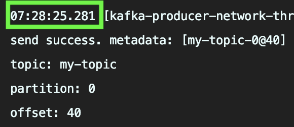
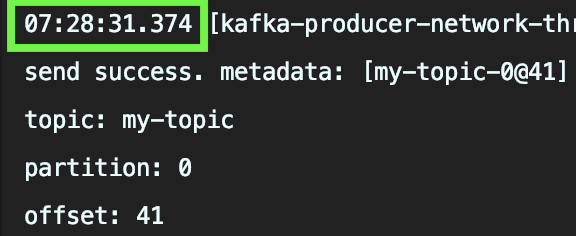

## Callback 메서드 (54p 참조)
Callback 메서드는 Async 메시지 전송 후, 브로커에서 온 응답을 처리한다.  
같은 파티션으로 보내는 메시지는 순서대로 브로커에 전송되고, 브로커에서 순서대로 응답이 돌아온다.
그리고 그 응답은 Callback 에서 처리한다.  

만약, 이 Callback에서 처리하는 로직이 느리고 복잡하다면 문제가 될 수 있다.  
아래의 코드에서 `try { Thread.sleep(5000); } catch (Exception e){}` 부분은 `5초가 걸리는 로직`이다.  
Async Producer는 1초마다 메시지를 전송한다면, 어떻게 동작할 지 예상해보자. 

~~~java
class MyProducerCallback implements Callback {
        @Override
        public void onCompletion(RecordMetadata metadata, Exception exception) {
            if (null != exception) {
                // fail
                exception.printStackTrace();
            } else {
                // success
                System.out.println("send success. metadata: [" + metadata + "]");
                System.out.println("topic: " + metadata.topic());
                System.out.println("partition: " + metadata.partition());
                System.out.println("offset: " + metadata.offset());
                try { Thread.sleep(5000); } catch (Exception e){}
            }
        }
    }
~~~

## Answer
~~~java
MyProducer producer = new MyProducer();
producer.send();
Thread.sleep(1000);
producer.send();
~~~
위의 실행로그는 아래와 같다.  
`오래걸리는 Callback`이 Producer의 메시지전송 성능에 영향을 미친것이다.  
Kafka에서는 Callback에서 별도의 쓰레드를 통해 처리할 것을 권장한다.

