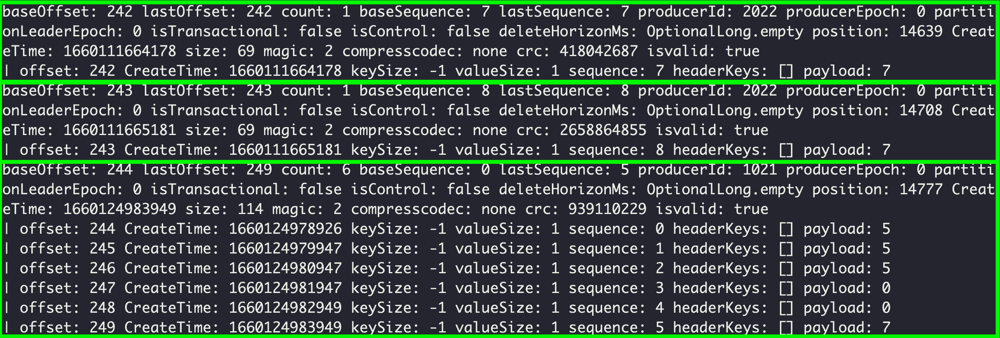

## linger.ms (p153 참조)
Kafka 프로듀서 설정에는 `linger.ms`가 있다.  
이는 프로듀서가 메시지를 전송할 때에 얼만큼 기다렸다가(메시지를 모았다가) 메시지를 전송할지에 대한 설정이다.  
디폴트는 0이다. 즉시 전송한다는 의미이다.  

하지만, Kafka 공식가이드는 이를 조금이라도 설정하기를 권장한다.    

Kafka 메시지에는 프로듀서가 전송하는 데이터(payload)도 있지만, 기본적으로 헤더가 붙는다.
이 정보에는 메시지포멧의 버전(magic number), batch의 크기 등 전송되는 batch의 메타정보라고 할 수 있다.  
이를 메시지마다 거의 같도록 중복하여 전송하는것은 브로커의 디스크의 낭비이고 불필요한 네트워크의 낭비이며, 성능도 저하된다.  

아래 예시는 linger.ms를 기본(0)으로 보내다가, linger.ms=5000으로 설정하여 5개의 데이터를 batch로 묶어서 전송한 예시이다.

~~~
$ bin/kafka-run-class.sh kafka.tools.DumpLogSegments --deep-iteration --print-data-log --files ~/kafka/kafka-logs/my-topic-0/00000000000000000024.log
~~~

