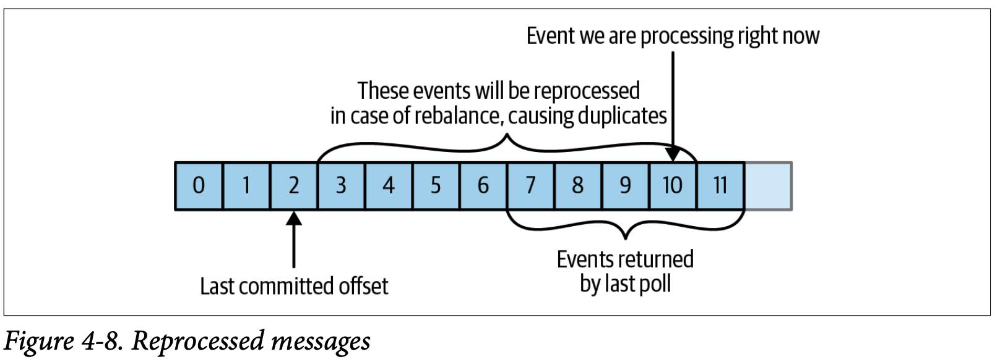
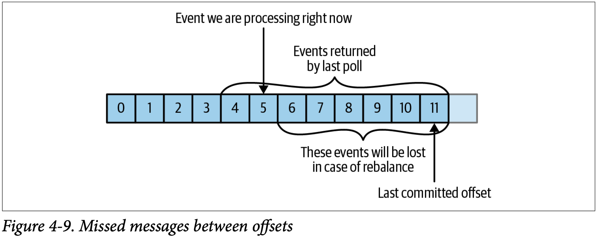

## Commits and Offsets (94p 참조)
Kafka 컨슈머의 commit에 대해서 알아보자.    

Kafka의 특징 중 하나는 각 컨슈머가 어디까지 읽었는 지 컨슈머가 저장하는 것이 아니라 브로커에 저장하는 것이다.    
컨슈머는 일정주기마다 (혹은 설정에 의해서 수동으로) 브로커로 특정 파티션에 대해서 어디까지 읽었는지를 알린다.  
이를 `offset commit` 이라고 한다. 그리고, 이를 `__consumer_offsets` 토픽에 저장한다.  
컨슈머가 모두 정상이고 메시지를 잘 처리하고 있다면 이 토픽이 쓰일 일은 없을 것이다.  
하지만, 컨슈머그룹의 특정 컨슈머가 비정상종료된다면 어떨까?  
브로커는 비정상종료된 컨슈머가 담당하던 파티션을 `rebalance` 해야 할 것이다.  
그리고, 해당 파티션을 새롭게 담당하게 될 컨슈머는 어디서부터 읽어야 할 지 알아야 할 것이다. 이런 경우에 `__consumer_offsets`이 사용될 수 있다.

이처럼, `offset commit`은 중요한 정보를 담고 있는데, 이를 관리하기는 쉽지많은 않다.  
메시지가 중복되거나 손실되는 경우를 살펴보자.

#### Reprocessed messages

위 그림은 2번까지 `offset commit`이 저장되고, 컨슈머는 10번까지 메시지를 처리완료하고 비정상종료된 예시이다.  
해당 컨슈머가 다시 정상상태로 돌아오거나, 혹은 다른 컨슈머가 해당 파티션을 담당하게 된다면 어디서부터 메시지를 다시 받아오게 될까?  
3번부터 받아오게 될 것이다. 그렇다면, 이미 처리가 완료된 3~10 번까지의 메시지는 중복처리될 것이다.

#### Missed messages

위 그림은 11번까지 `offset commit`이 저장되고, 컨슈머는 5번까지 메시지를 처리완료하고 비정상종료된 예시이다.  
해당 컨슈머가 다시 정상상태로 돌아오거나, 혹은 다른 컨슈머가 해당 파티션을 담당하게 된다면 어디서부터 메시지를 다시 받아오게 될까?  
12번부터 받아오게 될 것이다. 그렇다면, 6~11 번까지의 메시지는 손실될 것이다.
