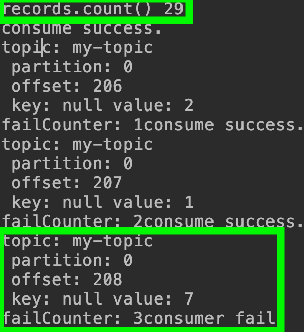
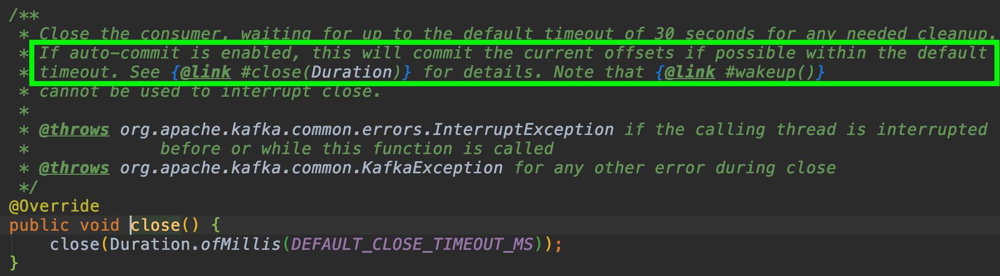
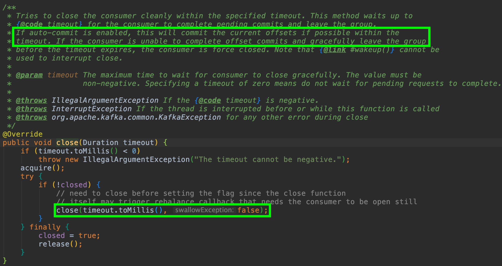
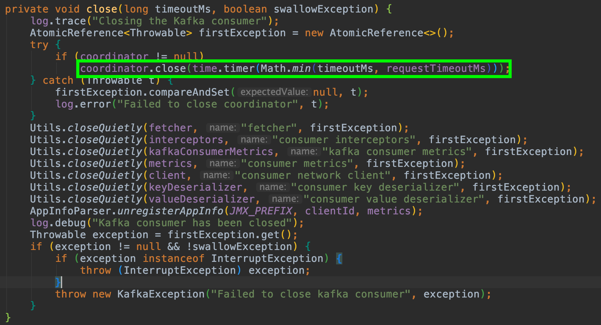
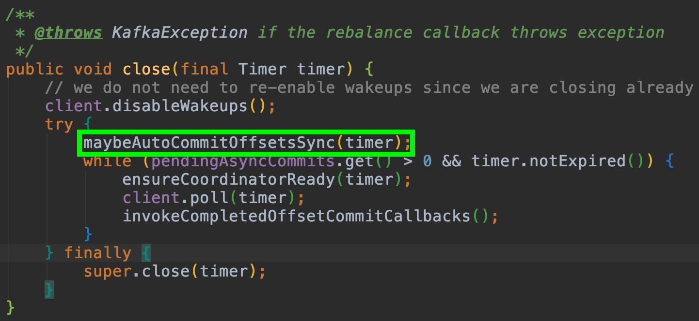
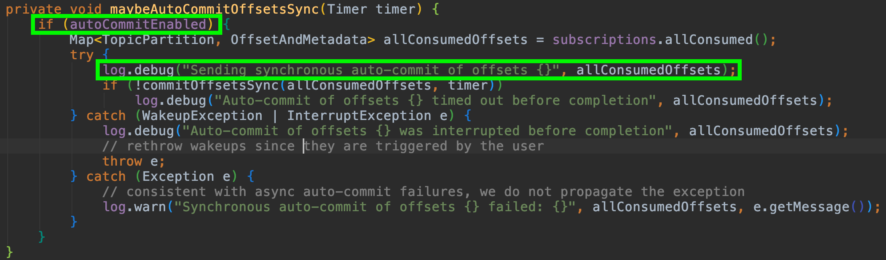

## Automatic Commit (95p 참조)
컨슈머는 기본적으로 `enable.auto.commit=true` 으로 설정되어있다.  
일단, 이것이 어떻게 작동하는 지 이해해야 한다.
컨슈머는 `auto.commit.interval.ms` 마다 `offset commit`을 전송한다.  
`auto.commit.interval.ms=5000` 으로 설정헀다면, 컨슈머는 5초마다 `offset commit`을 전송할까?   
그렇지 않다. `offset commit`은 기본적으로 `poll()`을 전송할때에 같이 전송된다.  
이 의미는 컨슈머가 `poll()`을 수행할 때에 `auto.commit.interval.ms`이 지났는 지 체크하고, 지났다면 `offset commit`을 보낸다는 의미이다.     
consume 로직이 5초보다 오래 걸린다면, `poll()` 수행마다 `offset commit`이 전송될 것이다.  
consume 로직이 5초보다 적게 걸린다면, `poll()` 수행 시 `offset commit`이 전송안될 수도 있는 것이다.

또한, 중요한 것은 `offset commit`이 `poll()` 뿐 아니라, `close()` 에서도 전송된다는 부분이다.  
아래 테스트를 통해 확인해보자.

## enable.auto.commit=true 설정에서 close() 시 OffsetCommit 전송 확인
컨슈머가 3개의 메시지를 처리한 후에 실패하도록 설정해보자.

~~~java
public class MyConsumer {
    private int failCounter = 0;

    public void consume() {
        Properties properties = new Properties();

        // required setting
        properties.put("bootstrap.servers", "kafka-lb-11608160-eb90449ba349.kr.lb.naverncp.com:9092");
        properties.put("key.deserializer", "org.apache.kafka.common.serialization.StringDeserializer");
        properties.put("value.deserializer", "org.apache.kafka.common.serialization.StringDeserializer");

        // optional setting
        properties.put("group.id", "test-group-id-1");
//        properties.put("auto.offset.reset", "earliest");

        KafkaConsumer consumer = new KafkaConsumer(properties);
        consumer.subscribe(Collections.singletonList("my-topic"));
        Duration timeout = Duration.ofMillis(1000);
        try {
            while(true) {
                ConsumerRecords<String, String> records = consumer.poll(timeout);
                System.out.printf("records.count() %s\n", records.count());
                for (ConsumerRecord<String, String> record : records) {
                    System.out.println("consume success.");
                    System.out.printf("topic: %s\n partition: %d\n offset: %d\n key: %s value: %s\n",
                            record.topic(), record.partition(), record.offset(), record.key(), record.value());

                    System.out.printf("failCounter: %s\n", ++failCounter);
                    if (failCounter == 3) {
                        throw new RuntimeException("consumer fail");
                    }
                }
            }
        } catch (Exception e) {
            System.out.println(e.getMessage());
        } finally {
            consumer.close();
        }
    }
}
~~~

#### consume log

29개의 레코드를 가져온 것을 확인했고, 3개의 메시지를 처리후에 실패했기 때문에 `close()`가 호출되었을 것이다.  
206번부터 메시지를 읽는것을 보니, 206~234까지의 메시지를 가져왔을 것이다.  
`close()`를 따라가보자.

#### close()

여기까지 확인해보니 `autoCommitEnabled` 상태이면 이미 가져온 offset을 commit 하는것을 알 수 있다.  
실제 로그는 아래와 같다. 

~~~
groupId=test-group-id-1] Sending synchronous auto-commit of offsets {my-topic-0=OffsetAndMetadata{offset=235, leaderEpoch=0, metadata=''}}
Sending OFFSET_COMMIT request with header RequestHeader(apiKey=OFFSET_COMMIT, apiVersion=8, clientId=consumer-test-group-id-1-1, correlationId=12) and timeout 30000 to node 2147483645: OffsetCommitRequestData(groupId='test-group-id-1', generationId=33, memberId='consumer-test-group-id-1-1-d2dc33a2-5455-414b-b440-3a10cea2f08a', groupInstanceId=null, retentionTimeMs=-1, topics=[OffsetCommitRequestTopic(name='my-topic', partitions=[OffsetCommitRequestPartition(partitionIndex=0, committedOffset=235, committedLeaderEpoch=0, commitTimestamp=-1, committedMetadata='')])])
~~~

`committedOffset=235`으로 호출을 보내는것을 알 수 있다.

#### 결론
`다시 컨슈머를 정상화시킨다면 235번부터 메시지를 받아올 것이기 때문에, 208~234 까지의 메시지는 손실된 것이다.`  
`enable.auto.commit=true` 을 사용한다면 컨슈머가 종료되기 전에 이미 가져온 메시지는 어떻게든 처리해야 하는 것이다.  

