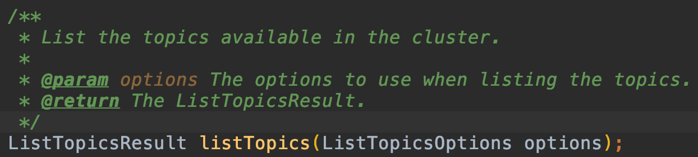
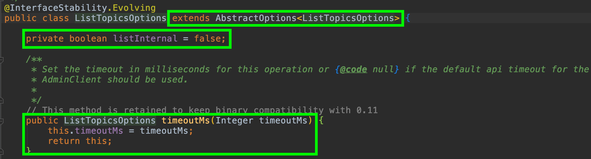

## AdminClient (114p 참조)
Kafka는 많은 모니터링 툴이 있다. [AKHQ](https://akhq.io/)를 많이 사용한다.  
대부분의 Kafka 모니터링 툴에서는 메시지를 확인할수도 있고, 토픽도 생성할 수 있고, 파티션을 늘리거나 줄일수도 있다.  
어떻게 가능한 것인가?

AdminClient를 사용해보자.

## Eventual Consistency
Kafka AdminClient의 가장 큰 특징 중 하나는 `Eventual Consistency` 이다.  
기본적으로 AdminClient는 `Async`로 작동한다. 그리고 이 동작은 브로커 중 controller에 업데이트되었다면 성공으로 반환된다.  
예를 들어, AdminClient로 `createTopics`를 호출하고, `listTopics`를 곧바로 호출한다면 `listTopics`에는 방금 생성한 토픽이 반환되지 않을수도 있다는 의미이다.  
controller 브로커와 나머지 브로커간의 replication에 시간이 걸릴 수 있기 때문이다.  
`하지만, 언젠가는 모든 브로커에 토픽생성에 대한 정보가 일치될 것이다.` 이를 `Eventual Consistency` 이라고 한다.

## Options
모든 AdminClient 메서드에는 해당 메서드에 특화된 `Options`를 파라미터로 받는다.  
예를 들어, `describeCluster` 메서드에는 `DescribeClusterOptions`를 파라미터로 받고,  
`listTopics` 메서드에는 `ListTopicsOptions`를 파라미터로 받는 것이다.  
또한, 모든 메서드에는 `timeoutMs`를 설정할 수 있는데, 이는 메서드마다 수행되는 시간에 따라 `timeout`을 다르게 설정할수 있게 하는 목적이다.

위 사진을 보면 `ListTopicsOptions` 메서드는 `listInternal (내부토픽 노출여부 설정)`를 변수로 가지고 있다.
또한, Kafka AdminClient의 모든 요청은 공통으로 `AbstractOptions`를 상속받음으로서 `timeoutMs`를 설정하고 있음을 알 수 있다.

## 기본 예시
~~~java
public class MyAdminClient {
    private AdminClient adminClient;

    public MyAdminClient() {
        Properties properties = new Properties();
        properties.put("bootstrap.servers", "kafka-lb-11608160-eb90449ba349.kr.lb.naverncp.com:9092");

        this.adminClient = AdminClient.create(properties);
    }

    public void listTopics() throws Exception {
        ListTopicsResult result = this.adminClient.listTopics();
        result.names().get().forEach(System.out::println);
    }
    
    public boolean isTopicExists(String topic) throws InterruptedException {
            DescribeTopicsResult result = this.adminClient.describeTopics(Arrays.asList(topic));
            Map<String, KafkaFuture<TopicDescription>> nameFutures = result.topicNameValues();
    
            try {
                TopicDescription topicDescription = nameFutures.get(topic).get();
                System.out.printf("name: %s\nisInternal: %s\n", topicDescription.name(), topicDescription.isInternal());
                return true;
            } catch (InterruptedException e1) {
                System.out.println(e1.getMessage());
                throw e1;
            } catch (ExecutionException e2) {
                System.out.println(e2.getMessage());
                if (e2.getCause() instanceof UnknownTopicOrPartitionException) {
                    System.out.printf("topic %s doesn't exists.\n", topic);
                    return false;
                }
            }
    
            throw new InterruptedException();
    }
}
~~~

~~~java
public class Main {
    public static void main(String[] args) throws Exception {
        // AdminClient
        MyAdminClient myAdminClient = new MyAdminClient();
//        myAdminClient.listTopics();
        try {
            boolean isTopicExists = myAdminClient.isTopicExists("my-topic-false");
            System.out.printf("isTopicExists: %s\n", isTopicExists);
        } catch (InterruptedException e) {e.getCause();}
    }
}
~~~