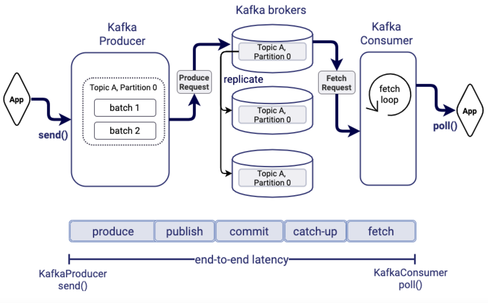
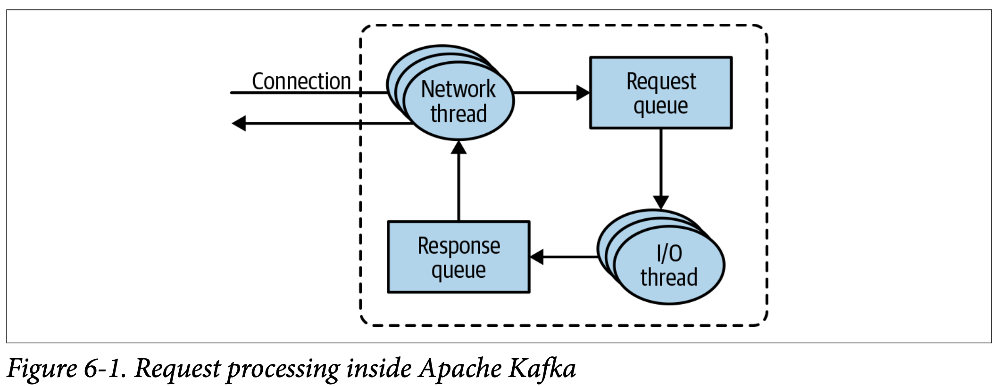
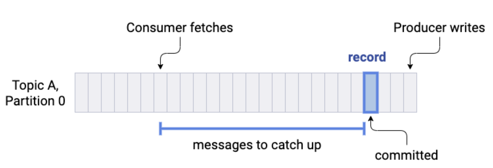
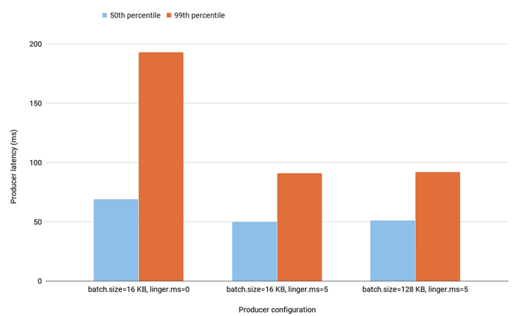
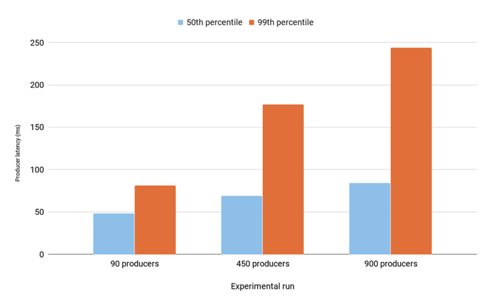
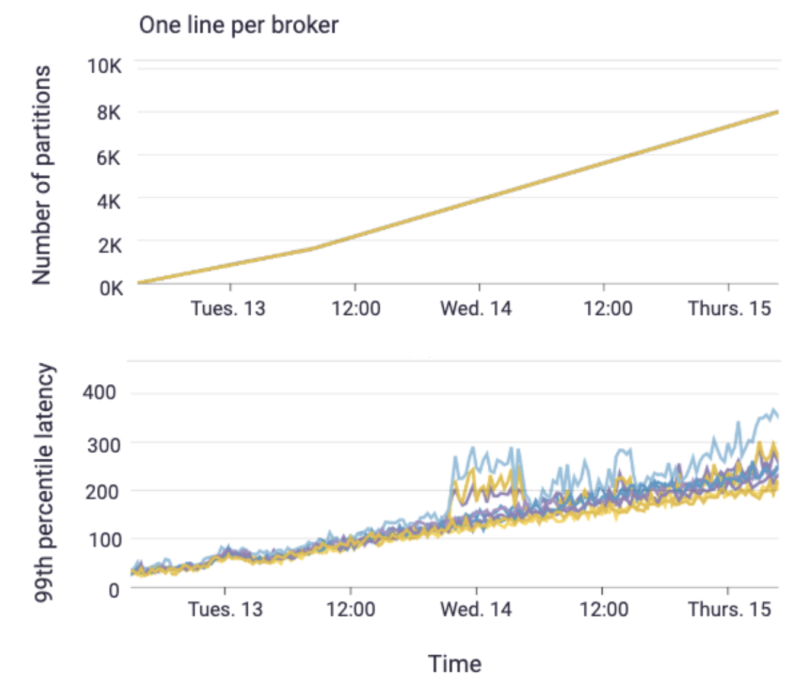

## End to end latency
이 글은 Confluent의 포스팅 '[99th Percentile Latency at Scale with Apache Kafka](- https://www.confluent.io/blog/configure-kafka-to-minimize-latency/)'를 대부분 번역한 내용이다.
프로듀서, 컨슈머, 브로커의 수 많은 설정값들을 아주 유익하게 설명한 것 같다.   

## Kafka end-to-end 지연의 이해
end-to-end 지연은 프로듀서의 `send()` 호출부터 컨슈머의 `poll()` 호출 뒤에 데이터를 받아오는 것 까지의 시간이다.  
이 시간에는 프로듀서 내부에서 batch에 메시지들을 적재하는 시간, 브로커에서 메시지를 받고 복제하는 시간 혹은 컨슈머에서 해당 메시지를 받을 수 있을 때까지의 소요시간 등
여러 단계의 시간들이 전부 포함된다. 이는 크게 5가지로 나누어볼 수 있다.

#### 1. Produce time
`send()` 호출부터 실제 브로커로 `batch` 를 전송하기까지의 시간이다.    
혹은 브로커로 전송하기 전, 프로듀서 내부에서 레코드들을 `batch` 처리하는 시간으로 이해해도 좋다.    
알다시피, 프로듀서는 네트워크 비용, IO 비용을 최적화 하기 위해 같은 토픽의 같은 파티션으로 전송되는 레코드들은 `batch` 처리하여 전송한다.  
하지만 디폴트 설정은 `batch` 처리에 충분한 시간을 주지 않고 0으로 하여, 곧바로 전송하는 것이다. (`linger.ms`의 디폴트는 `0`이다.)
같은 토픽의 같은 파티션으로 가는 레코드라 할 지라도, 한 건이라도 전송요청이 오면 바로 브로커로 전송하는 것이다.  

메시지를 많이 전송하는 바쁜 프로듀서일수록 한번의 요청에 많은 데이터를 실어나르는 것이 더 효율적이다.  
목적지로 버스가 출발해야 하는데, 조금 기다리더라도 사람을 많이 태워서 보내는 것과 같다.  

이를 제어하는 설정이 `linger.ms`이다.   
여기에 설정한 시간만큼 프로듀서는 브로커로 데이터를 바로 전송하지 않고, `batch` 처리를 하기위해 대기한다.  
혹은, `batch`의 크기로 제어할 수도 있다. 특정 크기만큼 `batch`가 쌓였다면 시간에 관계없이 전송하는 것이다.  
이를 제어하는 설정은 `batch.size`이다.

또 다른 설정으로는 `compression.type`이 있다. 프로듀서는 한번의 요청에 많은 레코드를 쌓을수록 성능이 좋아질 수 있다고 하였다.  
압축을 하면 당연히 더 많이 보낼 수 있을 것이다. 

프로듀서가 브로커로 `batch`를 전송하면 브로커로부터 `ack`가 반환된다.  
`max.inflight.requests.per.connection`는 브로커로부터 `ack`가 오지 않아도 프로듀서가 데이터를 전송할 수 있는 최대 전송가능 개수이다.   
기본값은 `5`이다.
     
#### 2. Publish time
프로듀서가 브로커로 레코드를 전송한 시점부터, 
해당 레코드를 (follower 파티션을 보유한 다른 브로커가 복제해갈 수 있는) leader replica log에 적재하기까지의 시간이다.  

브로커는 프로듀서로부터 요청를 받으면 브로커에서는 별도의 쓰레드가 해당 요청을 `request queue`에 적재한다.  
그 다음에는 요청처리를 담당하는 쓰레드가 `request queue`에서 해당 요청을 읽어서 처리한다. 
따라서, `publish time`은 프로듀서가 브로커로 메시지를 전송하는 네트워크시간, 브로커에서 해당 요청을 `request queue`에 적재하는 시간,
그리고 요청처리 쓰레드가 해당 요청을 처리하는 시간등을 포함한다.  
만약 브로커가 감당할 수 없을만큼 요청이 많이 들어온다면, `request queue`에 적재하고 데이터를 처리하는 시간이 그만큼 지연될 것이다.
    
    
#### 3. Commit time
프로듀서로부터 요청받은 데이터를 모든 in-sync 레플리카에 복제하기까지 걸리는 시간이다.  
우리는 프로듀서 요청부터 컨슈머의 데이터 읽기까지 end-to-end 지연을 확인하고 있고, 
컨슈머가 데이터를 읽으려면 데이터는 모든 in-sync 레플리카에 복제되어야 한다.  
따라서, 이 시간은 가장 속도가 느린 in-sync 레플리카가 데이터를 복제해가는 데 걸리는 시간과 동일하다.

레플리카는 컨슈머가 토픽을 읽어가는 것처럼 똑같이 리더로부터 데이터를 복제해간다.
`replica.fetch.min.bytes`는 레플리카가 데이터를 복제해가기 위한 최소 사이즈이다.
`replica.fetch.wait.max.ms`는 최대 대기시간이다. 이 시간이 되면 `replica.fetch.min.bytes`를 다 채우지 못했어도 데이터를 복제해갈 것이다.

#### 4. Catch-up time

컨슈머가 처리하고 있는 offset과 우리가 방금 전송한 레코드를 읽기까지의 시간이다.  

#### 5. Fetch time
컨슈머의 `poll()` 시점으로부터 실제 데이터를 받아오기까지의 소요시간이다.  
`fetch.min.bytes` 설정에 따라 컨슈머는 데이터를 바로바로 가져오지 않고, 일정 크기만큼 데이터가 쌓인뒤에 가져오도록 설정할 수 있다.  
이 설정은 데이터를 `fetch` 하는 최소크기이다. 디폴트는 `1`이다.  
혹은, `fetch.max.wait.ms` 설정을 통해 `fetch` 최대 대기시간을 설정할 수도 있다. 
`fetch.min.bytes` 를 다 채우지 못하더라도 `fetch.max.wait.ms` 만큼 시간이 지나면 `fetch` 할 것이다.

## batch 처리를 위한 프로듀서 설정
프로듀서의의 `batch`처리는 `batch.size(디폴트 16KB)`와 `linger.ms(디폴트 0)` 두 설정에 영향을 받는다.  
프로듀서가 충분히 바쁘다면 `linger.ms=0` 으로 설정되어있다 하더라도 `batch` 처리가 될 것이다. 
하지만 프로듀서가 처리량이 많지않다면, `batch` 처리를 위해 `linger.ms` 를 올리는 것이 도움이 될 것이다. 

프로듀서의 `batch`처리는 컨슈머에도 영향을 준다.  
`batch` 크기는 컨슈머가 `fetch`하는 최소단위가 되기 때문이다.
 
아래의 시나리오는 90개의 프로듀서가 108개의 파티션을 가진 하나의 토픽으로 레코드를 전송하는 시나리오이다.  
프로듀서의 전체 처리량은 `90 MB/sec` 이다. 

마치, 100명의 인원을 20명이 탑승가능한 버스로 이동시키는데, 기존에는 5명씩태운 20대의 버스를 보냈다면, 
지금은 20명씩 꽉 채워서 5대를 보내는 것과 같다.

`linger.ms=0`에서 `linger.ms=5`로 조정하니 상위 99%로 느린 메시지의 지연시간이 눈에띄게 줄어들었다.  
실제 프로듀서의 요청 개수는 2800개에서 1100개로 줄어들었다.  

`batch.size`를 16KB에서 128KB로 늘린것은 별 효과가 없어보인다.  
왜냐하면, 프로듀서는 168KB를 채우기 전에 `linger.ms=5`조건에 걸려서 `batch`가 전송되었을 것이기 때문이다.

## 클라이언트의 개수와 지연의 관계
일반적으로 클라이언트의 개수가 늘어난다는것은 브로커에게 부담이 된다.  
클라이언트가 늘어난만큼 브로커에게 metadata 요청이 늘어날 것이기 때문이다.  
각 프로듀서는 `max.inflight.requests.per.connection` 만큼의 요청을 브로커로 할 것이고,  
각 컨슈머는 브로커마다 `fetch` 요청을 할 것이다. 

컨슈머의 처리량을 높이기위해서 주로 파티션의 개수만큼 컨슈머를 설정하곤한다.   
하지만, 프로듀서도 동일할까?  

프로듀서의 개수를 확장했다고 가정해보자. 프로듀서의 처리성능은 좋아질까?  
처리량이 이전과 비슷한데 프로듀서를 확장했다면, 각 프로듀서가 전송하는 `batch`의 크기는 작아지고 브로커로 들어가는 요청개수는 늘어날 것이다.  
같은 처리량인데 프로듀서 개수를 늘리면 브로커가 처리해야 할 데이터 크기는 똑같지만, 요청 개수만 늘어나게 되는 것이다. 이는 브로커에 부담을 줄 수 있다.
`request queue`에 들어가는 개수만 많아지기 때문이다.  

아래 시나리오는 `batch.size=16KB, linger.ms=5`로 동일하게 설정하고, 프로듀서의 개수만 변경한 것이다.

프로듀서를 90개에서 900개까지 증가시켜보니 중간값은 60%정도 지연시간이 증가했고,  
상위 99%의 거의 가장느린 데이터는 3배정도 지연시간이 증가했다.

이는 프로듀서의 요청수가 폭발하면서 브로커의 지연을 일으켰고, 결과적으로 프로듀서가 `ack`를 받기까지 대기하는 시간이 증가하였기 때문이다.  
프로듀서의 성능향상은 이전에 논의했던 batch 성능의 개선을 통해 하는 것이지, 개수 증가를 통해서 하는 것이 아니다.

## 파티션 개수와 지연과의 관계
파티션의 개수를 늘리면 늘어난만큼 프로듀서, 컨슈머가 병렬적으로 처리할수 있기 때문에 처리량이 증가할 수 있다.  
그러나 항상 그렇지는 않다. 지나치게 많은 파티션 개수는 오히려 지연을 유발할 수 있다.

프로듀서의 관점에서는 파티션의 개수를 늘릴수록 `batch`의 성능이 떨어진다. 
브로커의 관점에서는 레플리카 복제성능이 떨어질 수 있다. 하나의 토픽에서 파티션의 개수를 100개에서 1000개로 늘렸다고 가정해보자. (replication=3)  
파티션과 레플리카가 고르게 분배되었다고 가정하면, 각 브로커는 복제해야하는 파티션의 연산량이 증가하게 된다. 어떤 브로커에서 어떤 파티션을 복제해와야 하는지 부하가 늘어난 것이다.  
리더 파티션의 입장에서도 복제 파티션들이 어디까지 복제가 완료되었는지 전부 연산해야 하는데, 이 연산량이 늘어나게 된다.

브로커의 연산량 증가는 결국 파티션이 불필요하게 많은 토픽 뿐 아니라, 정상적인 다른 토픽에도 영향을 주게 된다.  
결국, end-to-end 지연이 늘어나게 될 수 있는 것이다. 
이는 카프카 클러스터 관리자의 입장에서 브로커 별 관리하는 파티션의 개수를 모니터링하는것이 중요하다는것을 의미한다.

   

## Reference
- https://www.confluent.io/blog/configure-kafka-to-minimize-latency/
- https://cwiki.apache.org/confluence/display/KAFKA/KIP-103%3A+Separation+of+Internal+and+External+traffic