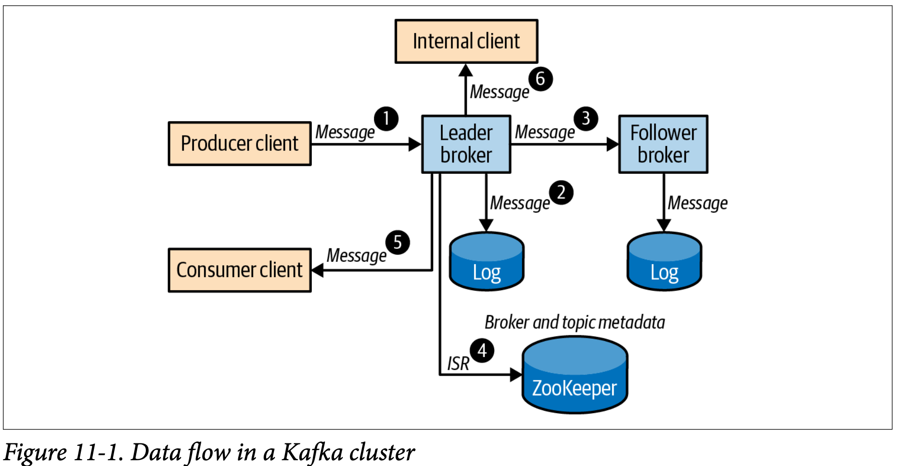
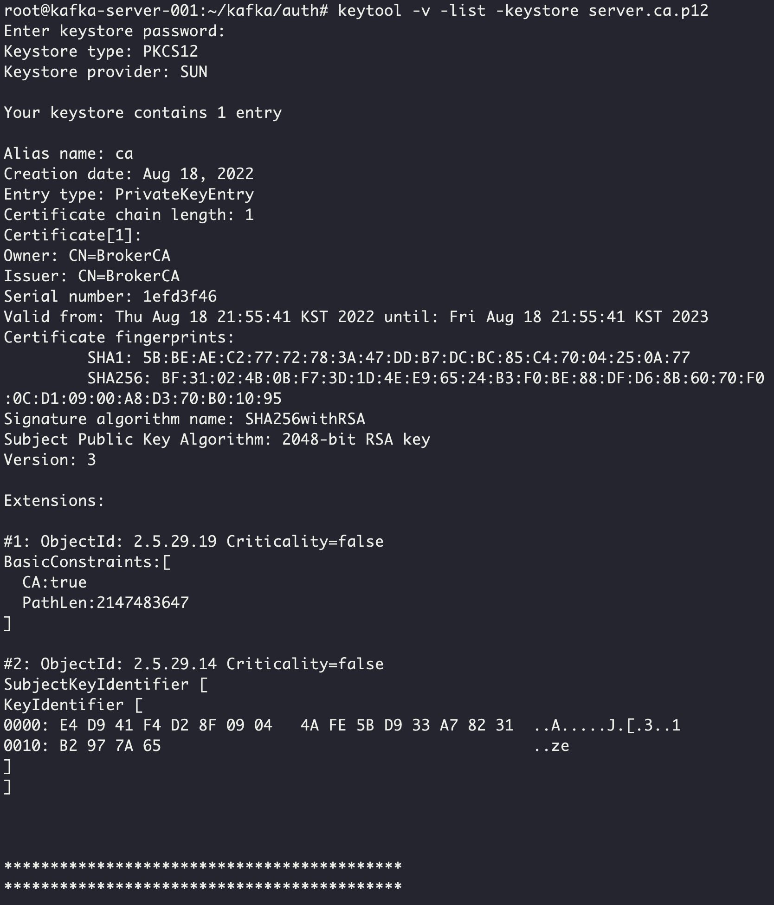
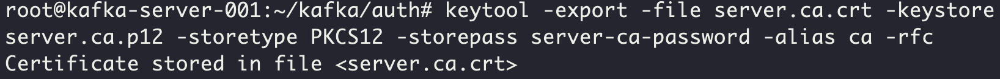
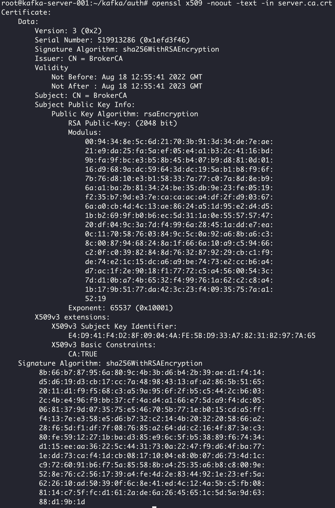
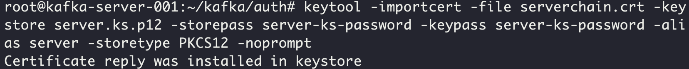
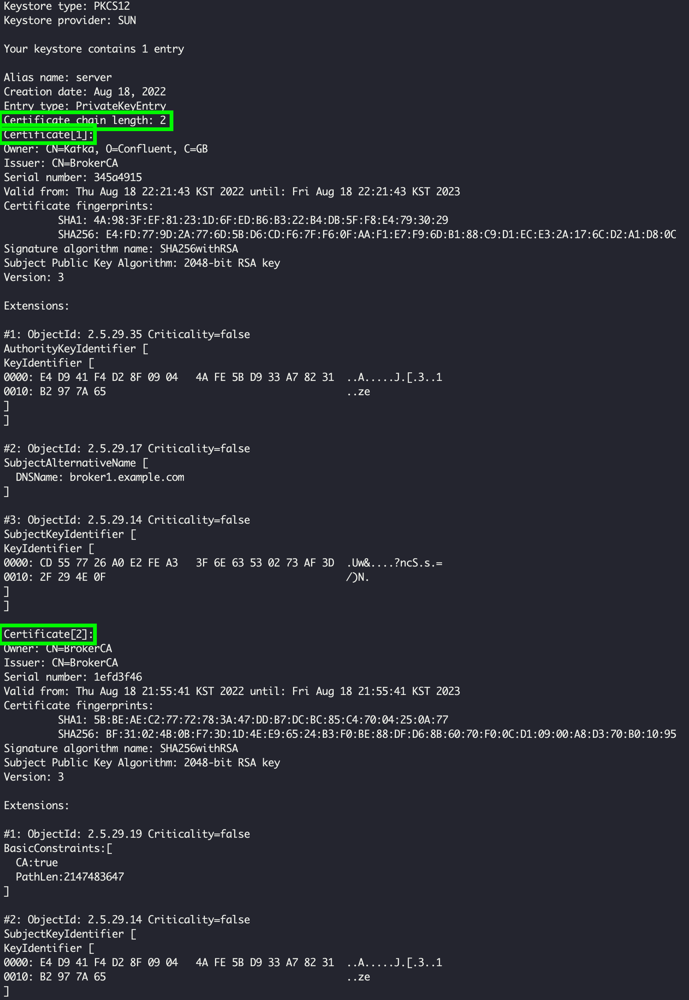

## Kafka Authentication (p265 참조)
Kafka는 프로듀서-브로커 간, 혹은 브로커-브로커 간, 혹은 컨슈머-브로커 간에서 등 다양한 통신구간에서
데이터 통신보안을 설정할 수 있다.

이중에서 프로듀서-브로커 간의 통신을 설정해보자.
별도의 인증서가 없기 때문에 self-signed CA를 이용할 것이다.

#### self-signed CA 인증서 생성을 위한 key-pair 생성
가장 먼저 self-signed CA를 만들어야 한다.  
CA의 key-pair를 생성한다.

경로는 `$KAFKA_HOME/auth`로 한다.

~~~
# key-pair 생성
$ keytool -genkeypair -keyalg RSA -keysize 2048 -keystore server.ca.p12 -storetype PKCS12 -storepass server-ca-password -keypass server-ca-password -alias ca -dname "CN=BrokerCA" -ext bc=ca:true -validity 365

$ ls
  server.ca.p12

# key-pair 생성 확인
$ keytool -v -list -keystore server.ca.p12
~~~

#### self-signed CA 인증서 생성
위에서 self-signed CA의 key-pair를 만들었으니, 이제 인증서를 만들 수 있게되었다.

~~~
# self-signed CA 인증서 생성
$ keytool -export -file server.ca.crt -keystore server.ca.p12 -storetype PKCS12 -storepass server-ca-password -alias ca -rfc
~~~ 

~~~
$ ls
~~~

~~~
$ openssl x509 -noout -text -in server.ca.crt
~~~

#### 브로커의 인증서 생성
self-signed CA의 인증서가 생겼다.  
브로커서버에서 self-signed CA로부터 인증서를 발급받아보자.
 
~~~
# 브로커의 private key를 생성한다.
$ keytool -genkey -keyalg RSA -keysize 2048 -keystore server.ks.p12 -storepass server-ks-password -keypass server-ks-password -alias server -storetype PKCS12 -dname "CN=Kafka,O=Confluent,C=GB" -validity 365

# 브로커의 csr을 생성한다.
$ keytool -certreq -file server.csr -keystore server.ks.p12 -storetype PKCS12 -storepass server-ks-password -keypass server-ks-password -alias server

# self-signed CA로 해당 csr을 확인하여 인증서를 발급한다.
$ keytool -gencert -infile server.csr -outfile server.crt -keystore server.ca.p12 -storetype PKCS12 -storepass server-ca-password -alias ca -ext SAN=DNS:broker1.example.com -validity 365

# 서버인증서와 self-signed CA의 인증서를 serverchain.crt에 복사한다.
$ cat server.crt server.ca.crt > serverchain.crt

# serverchain.crt를 server.ks.p12에 등록한다.
$ keytool -importcert -file serverchain.crt -keystore server.ks.p12 -storepass server-ks-password -keypass server-ks-password -alias server -storetype PKCS12 -noprompt
~~~

`server.ks.p12`를 조회하게되면, self-signed CA 인증서와 브로커의 인증서 두 개가 들어있는 것을 알 수 있다.

~~~
$ keytool -v -list -keystore server.ks.p12
~~~

#### 브로커는 이제 요청이 들어오는 클라이언트에게 무조건 SSL을 요구할 수 있다.
브로커에 인증서 정보들이 어디에 있는지 설정해주어야 한다.  
정보를 설정해주고 브로커를 재시작해보자.
 
~~~
# vi server.properties
ssl.keystore.location=/root/kafka/auth/server.ks.p12
ssl.keystore.password=server-ks-password
ssl.key.password=server-ks-password
ssl.keystore.type=PKCS12
ssl.client.auth=required
~~~

#### 프로듀서의 TrustStore 설정
이제 브로커에 self-signed CA의 인증서와 브로커 인증서가 있으므로, SSL 통신을 할 수 있게 되었다.  
하지만, 프로듀서에서는 self-signed CA를 믿을 수 없기 때문에 이를 `TrustStore`에 저장해주어야 한다.

